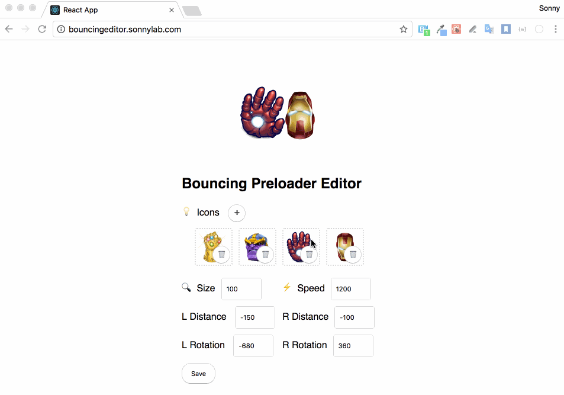

# React Bouncing Preloader

Bouncing Preloader Component with custom icons in ReactJS



Based on the dribbble shot by [Dany Rizky](https://dribbble.com/danyrizkyw):
https://dribbble.com/shots/4423936-Islands-Preloader-Animation


#### Demo

http://bouncingeditor.sonnylab.com/

#### Background

When I saw the preloader animation, I think it would be great if we can use our own icon and give more control to the bouncing animation and rotation. So I tried to make this open source component.

#### Goals

* Animate our own custom icon
* Flexible to use remote image url or local image file
* Able to control distance, rotation angle etc

#### Usage

* `npm install --save react-bouncing-preloader`
* In your react script add these lines

```jsx
import BouncingPreloader from 'react-bouncing-preloader';

<BouncingPreloader
  icons={[
    'https://www.shareicon.net/data/256x256/2016/05/04/759946_bar_512x512.png',
    require('./assets/image.png'),
  ]}
  leftRotation="-680deg"
  rightRotation="360deg"
  size={150}
  leftDistance={-180}
  rightDistance={-250}
  speed={1200} />

// or just give icons

<BouncingPreloader
  icons={[
    require('./assets/image1.png'),
    require('./assets/image2.png'),
  ]}/>
```

### Available props

* `icons`: PropTypes.array,
* `leftRotation`: PropTypes.string,
* `rightRotation`: PropTypes.string,
* `leftDistance`: PropTypes.number,
* `rightDistance`: PropTypes.number,
* `speed`: PropTypes.number
* `size`: PropTypes.number

#### Contributing

* Feel free to open PR.

#### Examples

Most of the credit goes to [Dany Rizky](https://dribbble.com/danyrizkyw) for the design inspiration.

#### License

MIT Licensed
